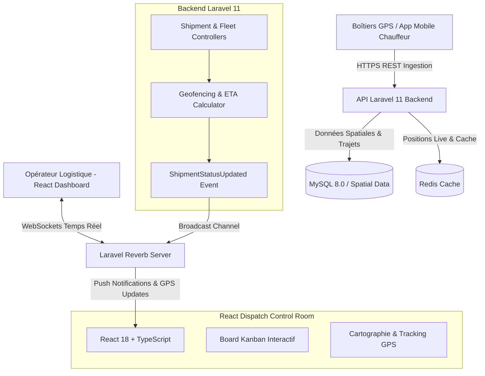

# 🚚 SupplyLog / AfriFleet — TMS & Suivi Logistique Temps Réel

[](https://www.php.net/)
[](https://laravel.com/)
[](https://react.dev/)
[](https://www.typescriptlang.org/)
[](https://laravel.com/docs/11.x/reverb)
[](https://tailwindcss.com/)

Plateforme de gestion de flotte, de suivi des expéditions de fret et de traçabilité logistique en temps réel reliant le Port de Cotonou aux corridors intérieurs et régionaux (Bénin, Niger, Burkina Faso, Mali).

---

## 🏛️ Architecture Technique



---

## 📂 Structure du Répertoire

```text
projet-2-supplylog-fleet-tms/
├── docker-compose.yml          # Backend + Reverb + MySQL + Redis + React
├── README.md                   # Documentation technique
├── backend/                    # API Laravel 11 avec WebSockets
│   ├── app/
│   │   ├── Events/             # ShipmentStatusUpdated.php (Broadcast)
│   │   ├── Http/Controllers/   # ShipmentController, FleetController
│   │   └── Models/             # Shipment, Vehicle, Driver, Waybill
│   ├── routes/api.php          # Endpoints logistiques
│   ├── composer.json
│   └── Dockerfile
└── frontend/                   # Tour de Contrôle React
    ├── src/
    │   ├── components/         # Board Kanban, Carte de suivi, Alertes
    │   ├── types/              # Types expéditions, véhicules, statuts
    │   ├── App.tsx
    │   └── main.tsx
    ├── package.json
    └── vite.config.ts
```

---

## 🚀 Démarrage Rapide

```bash
cd projet-2-supplylog-fleet-tms
docker-compose up -d --build
# Dashboard disponible sur http://localhost:3001
# Backend API sur http://localhost:8001/api/v1
```
